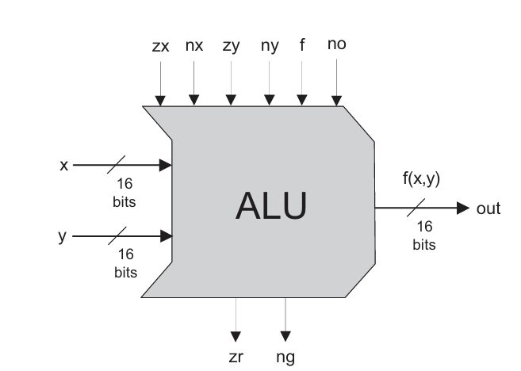
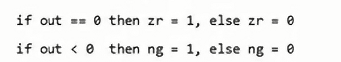

# 二进制加法
逐位相加，记得进位。
关于溢出的问题：最左位溢出，我们常常会忽略溢出。

# 单bit加法
两个输入，两个输出，分别是sum和carry（进位）

# 16-bit adder
利用15个full adder以及一个 half adder

# 负数表示
把第一位用在符号上。但这个在表示0的时候有比较大的问题。

人们一般使用$2^n-x$来表示$-x$.

$2^n-x=1+(2^n-1)-x=1+(1111111)-x$
而用1111111减去x等价于对x取反。

# ALU 算术逻辑单元
一个抽象单位，两个数值属于以及一个函数f输入，然后计算$f(x1,x2)$.
但是函数f很多时候是由控制位构成的。

那么ALU内部是如何运算的呢。

